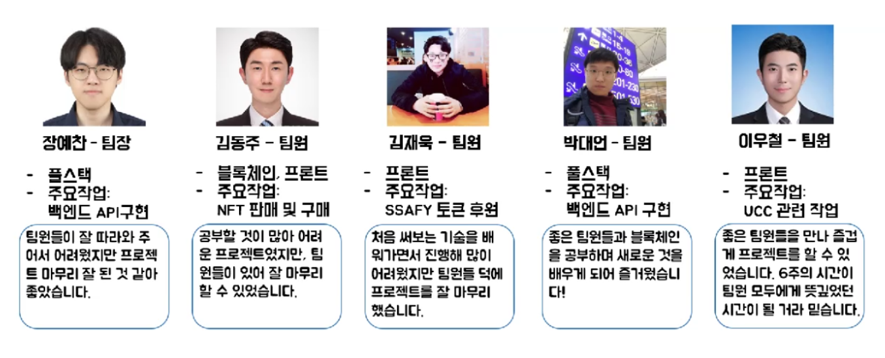
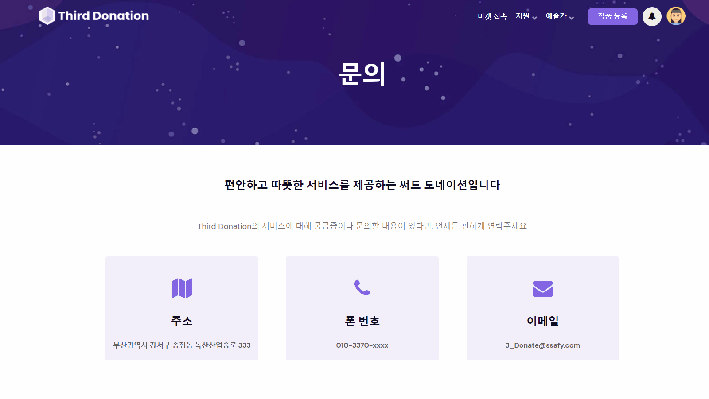
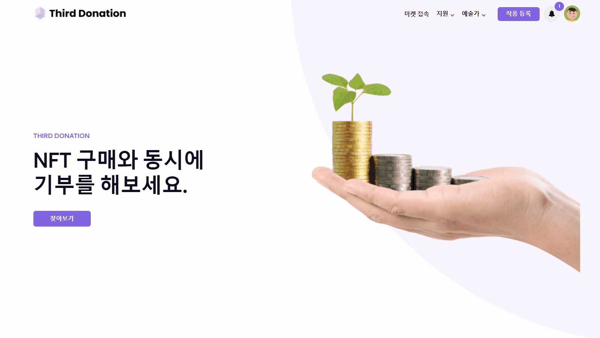
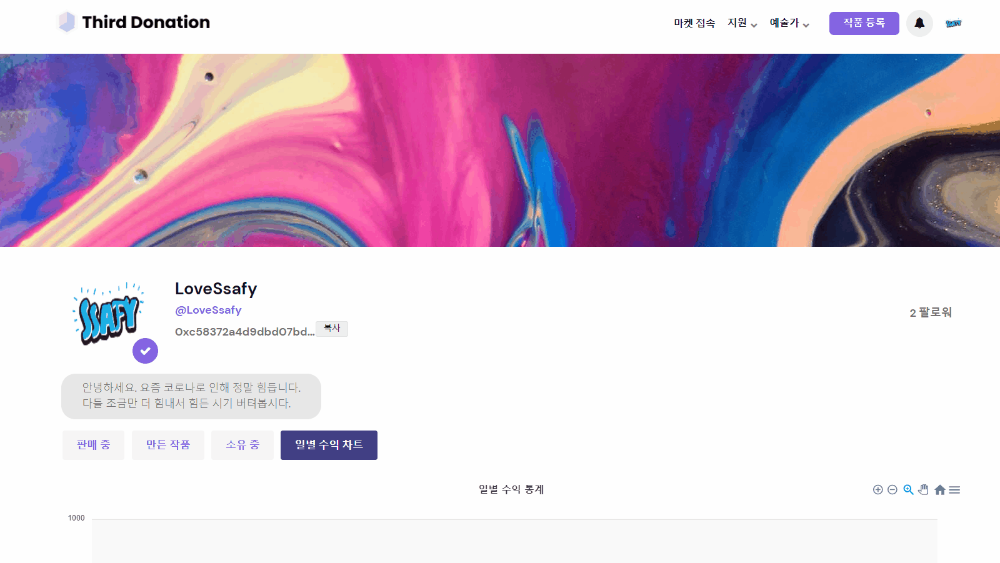
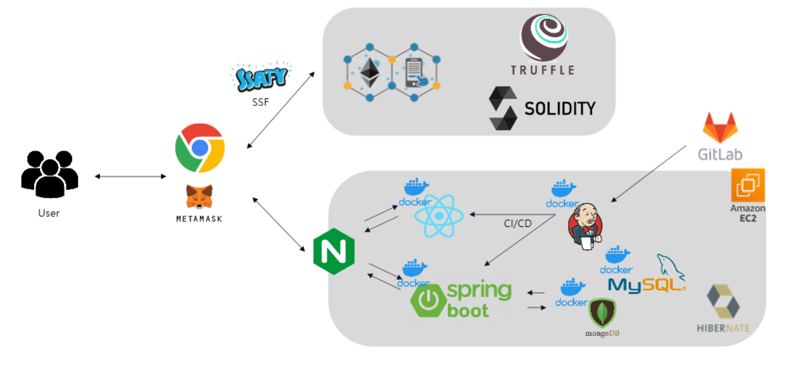
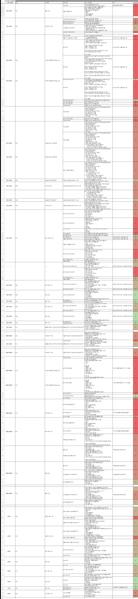
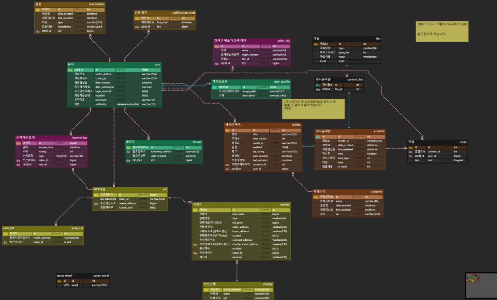

# README

# 👪 팀원 소개

대한민국을 대표하는 남자 가수 **김나박이**가 있다면,

이곳에는 싸피를 대표하는 남자 개발자 **김장박이**(**김**재욱, **김**동주, **장**예찬, **박**대언, **이**우철)이 있다!!!!!

------

# ✨프로젝트 소개

## Project Period

2022.02.21 - 2022.04.08 (7주)

## Overview

장애인 예술가 10명 중 7명가량은 예술 활동을 하면서도 그에 대한 금전적 보상을 전혀 받지 못하고 활동한다고 해요. 사람들이 장애인예술가의 작품에 대해 관심을 가질수록, 장애에 대한 인식도 개선이 되고 그럴수록 장애인 예술가분들이 활동할 수 있는 공간도 많아질거라 믿습니다.

## 서드 도네이션 이란?

서드 도네이션은 장애인 예술가 님들을 후원하기 위해 장애인 예술가 분들이 NFT를 만들 수 있고(민팅) 이를 사람들이 거래할 수 있도록 하여 장애인 예술가 님들에 대한 후원과 투자를 할 수 있는 플랫폼 서비스를 개발합니다.

## 기획 배경

[기존의 기부를 하지 않는 이유](https://www.hankookilbo.com/News/Read/201912221551392334)는  1위가 경제적 여유가 없어서, 3위가 기부단체에 대한 신뢰가 없어서인데 1위인 `경제적 여유가 없어서` 부분을 예술가들을 위한 후원이자 NFT 투자라는 형식으로 해결하고 3위의 `기부단체에 대한 신뢰가 없어서`는 NFT 거래상에 발생한 거래의 흐름이 온체인 상에 남기 때문에 모두에게 투명하게 공개되기에 이를 해결할 수 있다고 보고 진행하게 되었습니다.

서드도네이션은 생활과 취미에 이어 세 번째 인생활동을 사회기부와 투자로 모두가 행복해질 수 있는 서비스를 제공을 목표로 합니다. 장애인 예술가들의 작품을 더 많은 사람들에게 공개하고 후원받을 수 있는 기회를 제공하며 일반 이용자들에게는 투자와 함께 후원까지 할 수 있는 기회를 제공합니다.

## 서드 도네이션의 차별성

1. 장애인 예술가만을 위한 플랫폼입니다. (장애인등록증 인증이 필요함)
2. 구매 후에 작품을 다시 팔 수 있다는 장점이 있습니다.
3. 예술가들을 위한 수익의 통계를 한눈에 볼 수 있도록 제공합니다.
4. 예술가 및 일반 고객들의 프로필을 제공하여 내가 만든 작품(예술가만 가능), 판매중인 작품, 소유중인 작품을 볼 수가 있습니다.
5. NFT를 구매하면 장애인 예술가와 후원 단체에 각각 6%, 2%의 수익이 전해집니다.
6. 장애인 예술가들에게 응원 메시지를 함께 전할 수가 있습니다.

## 참고

영상: [**](https://youtu.be/PFZJZ5TIAgQ)https://youtu.be/PFZJZ5TIAgQ**

노션: https://redniche.notion.site/c362c3526e8f49d48b56594234573882

------

# 

# 🎨 주요 기능

**메타마스크 지갑 등록**

**홈**

**NFT마켓**

**작품 등록**

**프로필**

**프로필 수정**

**판매**

**구매**

**팔로우**

**좋아요**

**후원 메시지**

**장애인 예술가 등록**

**관리자 예술가 승인**

**공지사항**

**문의**

**알림**

**통계**

------

# 🖱 **기술 스택**

------

# 🖥️ 요구 사항 정의서

------

# 💫 ERD

------

# 👨‍👩‍👧 협업 툴

- Git
- Jira
- Notion
- Mattermost
- Webex

------

# ⚙ 개발 환경

### **CLIENTS**

- Framework: React 17.0.2
- IDE: Visual Studio Code (yarn)
- Language: JavaScript (ECMA-12)
- Frontend native languages
  - Web: HTML, CSS, JavaScript

### **SERVER**

- Framework: Spring Boot 2.5.6
- IDE: Spring Tool Suite 3 (Maven build)
- Language: Open JDK 11
- DB: MySQL 8.0, MongoDB 5.0
- WAS: Tomcat
- Host: AWS
- Server OS: Ubuntu 20.04 LTS

### **Blockchain**

- Framework: Truffle
- IDE: Visual Studio Code
- Language: Solidity
- Mainnet: Ssafy Network (private: http://20.196.xxx.xxx:xxxx/)

### **Docker**

- version: 20.10.7, build 20.10.7-0ubuntu5~20.04.2

------

# **💡Git Flow**

- **Git Flow 사용 브랜치**

  - master - 운영 서버로 배포하기 위한 브랜치
  - frontend/develop : 프론트엔드 개발하는 브랜치
  - backend/develop : 백엔드를 개발하는 브랜치
  - /feature - 세부 기능을 개발하는 브랜치

- **Git Flow 진행 방식**

  feature 브랜치가 완성되면 develop 브랜치로 pull request를 통해 merge한다.

  ⇒ pull request가 요청되면, 팀원들이 코드 리뷰를 하여 안전하게 merge한다.

- **feature 브랜치 이름 명명 규칙**

  [front or back or blockchain] / feature / [기능 이름]

  ex) frontend/feature/footer

  ex) backend/feature/sales-messages

------

# 😃 커밋 메시지 컨벤션

### COMMIT 규칙

- ADD - 코드,테스트,예제,문서 등 추가
- IMPLEMENT - 구현
- FIX - 버그,에러 수정
- REMOVE - 코드 삭제
- REFACTOR - 코드 전면 수정 or 리팩터링
- UPDATE - 버전 업데이트 및 코드 수정
- REVISE - 문서 개정

### 전체

- 커밋과 관련된 지라 이슈 넘버를 prefix로 남깁니다.

- 지라에 남긴 이슈에 맞게 커밋! (이슈 관점별로 분리), 지라에 이슈가 없을 경우 생략

- 예시:

  **태그: 커밋제목 ⇒**  fix: **Fix the bug related user and loadDonations** 

  **태그 #지라이슈번호,: 커밋제목 ⇒ feat #**S06P21E207-11: **Merge pull request #4 from redniche/admin/dev **

  **#지라이슈번호: 커밋제목 ⇒ #**S06P21E207-11: **Update README.md

------

# 👀 JIRA 규칙

- **Epic**

   : 큰 단위의 업무(여러 User Story, Task 등을 묶은 단위)

  - 작성 방법 ****:  큰 단위 업무, 회원관리, 로비 등

- **Story**

   : 최종 고객에게 가치를 제공하는 기능

  - 작성 방법 :  [개발환경] 개발기능, [Backend] 회원가입 기능, [Frontend] 로그인 기능 등
  - Tip) User story의 크기는 sprint내에 완료 가능한 단위로 분할 필요예) 사용자 관리 개발

- **Sub-Task**

  - 작성 방법 ****: 해당 스토리를 진행할 때, 진행하는 사람이 작성하기
    - 예시) 회원가입 유효성 검사 개발
  - Story, Task를 더 작은 단위로 나눈 업무
  - 즉, 모든 Sub-Task가 끝나야 해당 업무 종료. 예) 사용자 관리(UI) 개발, 사용자관리(Service) 개발

- **컴포넌트**

  - 개발 분야에 따라 분류, 각 스토리는 분류에 맞는 컴포넌트를 가지고 있어야함.

------

# 🐣 회고

- 코드 리뷰를 꼼꼼히 하자
- 문서화를 잘 하자
